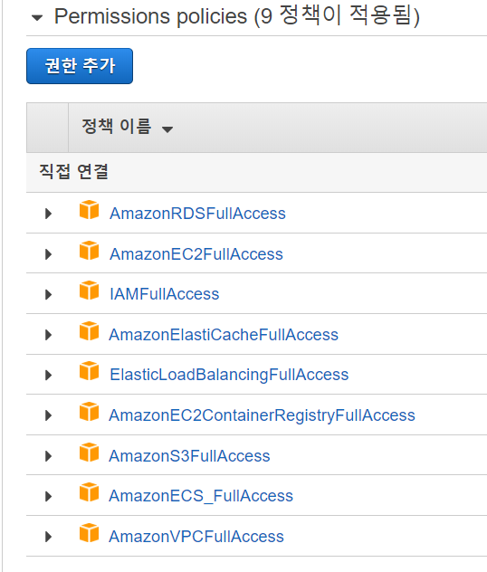

# AlgoSports Backend

## Development

### Branch

- 아래 포스트의 convention을 일부 차용해서 사용한다.
  - https://dev.to/couchcamote/git-branching-name-convention-cch

1. master
   - 실제 배포
2. develop
   - 개발 및 테스트
3. temporary branches

   - feat/<branch_name>
     - 기능 개발을 다루는 branch.
   - bugfix/<branch_name>
     - feature에서 발생한 버그를 다루는 branch.
   - hotfix/<branch_name>
     - master 브랜치에 바로 반영해야하는 버그를 다루는 branch.
   - experimental/<branch_name>
     - 테스트하고 싶은 기능을 다루는 branch.

### Installation

1. Activate virtual environment
2. Install packages
   ```shell
   pip install -r requirements/local.txt
   ```

### Utility

- 아래 커맨드로 확인 가능

```shell
fab -l
```

### Start local server

- API 서버
  ```shell
  fab runserver
  ```
- Celery broker
  ```shell
  redis-server
  ```
- Celery worker
  ```shell
  fab celery
  ```

### Test

```shell
pytest .
mypy .
```

## Build & Deploy

### 사전 준비물

- AWS CLI2 설치
  ```shell
  curl "https://awscli.amazonaws.com/awscli-exe-linux-x86_64.zip" -o "awscliv2.zip"
  unzip awscliv2.zip
  sudo ./aws/install
  ```
- ECS-CLI 설치
  ```shell
  sudo curl -Lo /usr/local/bin/ecs-cli https://amazon-ecs-cli.s3.amazonaws.com/ecs-cli-linux-amd64-latest
  sudo chmod +x /usr/local/bin/ecs-cli
  ```
- IAM 계정 생성 및 정책 연결
  

### ECS-CLI로 클러스터 생성

- 생성 후 만들어진 VPC, Subnets을 저장해둬야 합니다.
- key-pair를 먼저 생성하고 key-pair이름을 저장해둡니다.

```shell
# 환경변수 설정
AWS_DEFAULT_REGION=ap-northeast-2
CLUSTER_NAME=algo-cluster2
CONFIG_NAME=algo-config
PROFILE_NAME=algo-profile
INSTANCE_SIZE=3

KEY_PAIR=algo-keypair

# 클러스터 및 프로필 설정
ecs-cli configure --cluster $CLUSTER_NAME --region $AWS_DEFAULT_REGION --default-launch-type EC2 --config-name $CONFIG_NAME
ecs-cli configure profile --access-key $AWS_ACCESS_KEY_ID --secret-key $AWS_SECRET_ACCESS_KEY --profile-name $PROFILE_NAME
ecs-cli configure profile default --profile-name $PROFILE_NAME

# user-data 생성 (ecs-cluster에 연결하는 역할)
echo "#!/bin/bash \necho ECS_CLUSTER=jts-cluster >> /etc/ecs/ecs.config" > user_data.sh

# 클러스터 생성
ecs-cli up \
    --capability-iam \
    --keypair $KEY_PAIR \
    --size $INSTANCE_SIZE \
    --launch-type EC2 \
    --extra-user-data ./aws/user_data.sh
```

### Security Group 생성 및 80포트 오픈

```shell
VPC_ID=<Your VPC ID Here>
SG_NAME=algo-sg

# Security group 생성 및 GROUP_ID 저장
SG_GROUP_ID=$(aws ec2 create-security-group \
    --group-name "$SG_NAME" \
    --description "Security Group for ECS $CLUSTER_NAME" \
    --vpc-id $VPC_ID |
    jq -r ".GroupId")

aws ec2 authorize-security-group-ingress \
    --group-id $SG_GROUP_ID \
    --protocol tcp \
    --port 80 \
    --cidr 0.0.0.0/0
```

### ECR 로그인 및 레포지토리 생성

```shell
# ECR 레포지토리 생성
aws ecr create-repository --repository-name django |
    jq ".repository | .repositoryUri"

aws ecr create-repository --repository-name nginx |
    jq ".repository | .repositoryUri"
```

### ECR 저장소 이미지 배포

```shell
# ECR, Docker 로그인
aws ecr get-login-password --region $AWS_DEFAULT_REGION | docker login --username AWS --password-stdin $(aws sts get-caller-identity --query Account --output text).dkr.ecr.$AWS_DEFAULT_REGION.amazonaws.com/

docker-compose -f staging.yml -f production.yml build
docker-compose -f staging.yml -f production.yml push django nginx
```

### ECS Task IAM role 생성

```shell
# 빈 iam role 생성
aws iam create-role --role-name ecs-instance --assume-role-policy-document file://aws/assume-role.json

# 필요한 정책 추가
aws iam attach-role-policy --policy-arn arn:aws:iam::aws:policy/service-role/AmazonEC2ContainerServiceforEC2Role --role-name ecs-instance

# 인스턴스 프로필 생성
aws iam create-instance-profile --instance-profile-name ecs-instance-profile

# 해당 프로필에 롤 추가
aws iam add-role-to-instance-profile --instance-profile-name ecs-instance-profile --role-name ecs-instance

# instasnce profiles 출력
aws iam list-instance-profiles
```

### 서비스 생성

```shell
CONFIG_NAME=algo-config
PROJECT_NAME=algo-service

ecs-cli compose \
  --project-name $PROJECT_NAME \
  --file staging.yml \
  --file production.yml \
  --ecs-params ./aws/ecs-params.yml \
  service up \
  --create-log-groups \
  --cluster-config $CONFIG_NAME \
  --container-name nginx \
  --container-port 80 \
  --target-group-arn arn:aws:elasticloadbalancing:ap-northeast-2:648240308375:targetgroup/target/e3086c4f494a30c4 \
  --launch-type EC2
```

## 부딪힌 문제들

- Celery worker가 Redis를 인식 못하는 상황
  - 로컬에서는 잘 됐지만 AWS에 배포하는 순간 작동을 하지 않아서 남감했다.
  - docker-compose.yml의 links와 depends_on에 redis를 걸어주니까 해결됐다.
- RDS 연결
  - 같은 VPC에 연결이 돼있어야 한다.
  - entrypoint.sh에서 export 한 env는 환경에 적용이 되지 않았다.
  - .django, .postgres 파일로 해당 설정들을 옮겨주니 DATABASE_URL 환경변수도 잘 적용됐다.
- 502 에러 (nginx, ELB)
  - Target group을 잘 설정해야한다.
- Domain 문제
  - 가비아에서 주문한 도메인을 Route53에 등록한 뒤 ACM을 발급받으면 된다.
  - 이때 *.domain.com으로 해주면 편하다.
